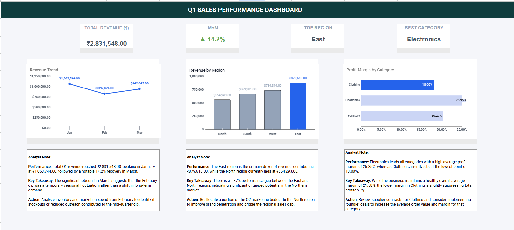
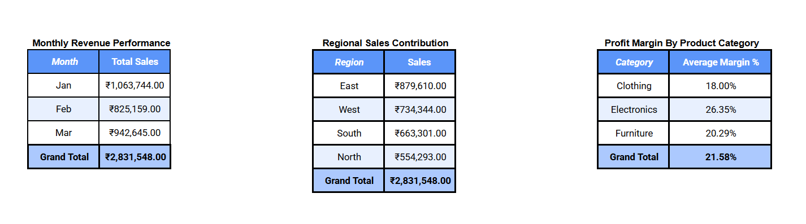

# Retail Sales Intelligence Dashboard

## Dashboard Preview

## **Analysis Preview**

## Project Overview
This project transforms raw transactional data into a high-level executive dashboard. It provides a synchronized view of monthly revenue trends, regional performance, and category profitability. The project focused on moving from volatile, shifting data to a stable "Source of Truth" for quarterly reporting.

## Key Technical Features
* **Performance Control:** Implemented technical range constraints (A1:M201) to optimize spreadsheet calculation speed and manage processing efficiency.
* **Data Integrity:** Reconciled all pivot tables to a verified Grand Total of **₹2,831,548.00**.
* **Analytical Framework:** Integrated "Analyst Notes" using the Performance-Takeaway-Action model to provide strategic recommendations based on the March revenue recovery.

## Tools & Technical Stack
* **Platform:** Google Sheets.
* **Data Modeling:** Pivot Table Architecture, Dynamic Sorting, and Advanced Filtering.
* **Visualization:** Custom Charting (Trend Lines, Regional Distribution, Categorical Profitability).
* **Formulas & Logic:** Arithmetic Modeling and Range-Fencing for performance optimization.
